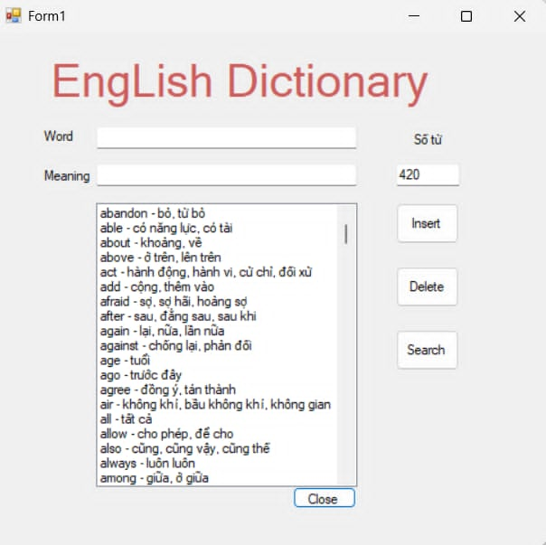
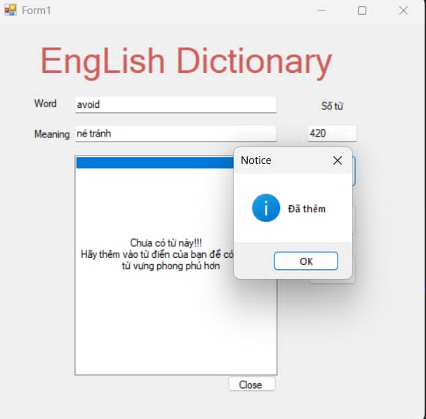
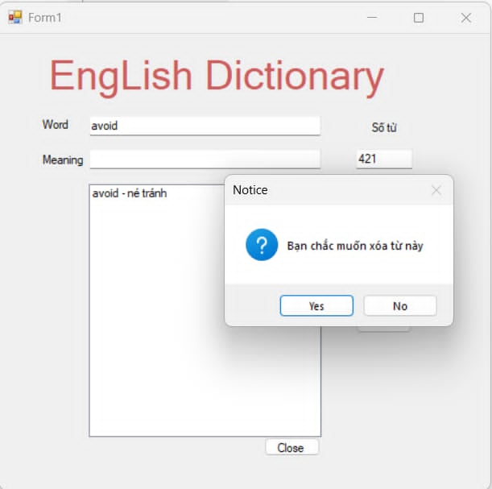
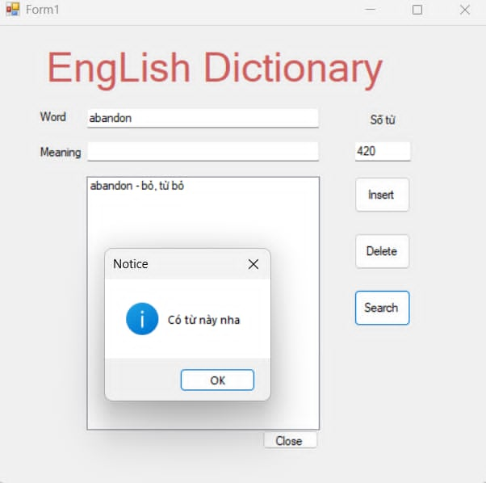
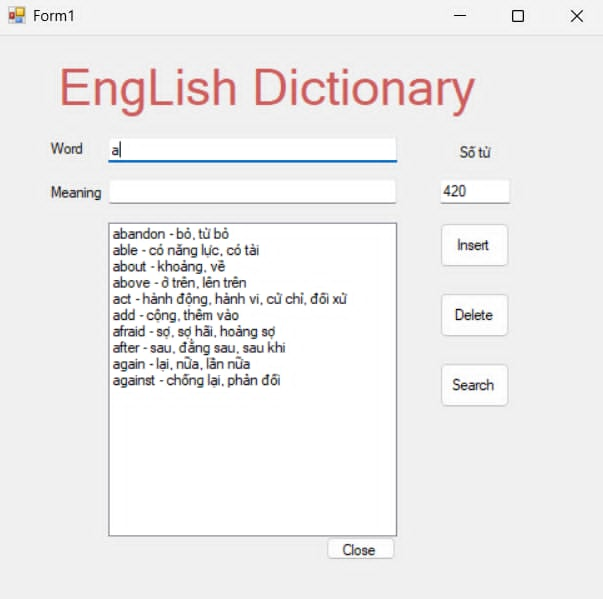
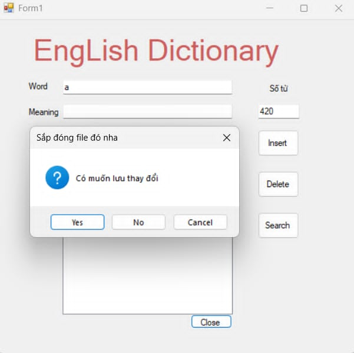

# Trie Tree

Trong khoa học máy tính, Trie, hay Cây Tiền Tố, là một cấu trúc dữ liệu sử dụng cây có thứ tự, dùng để lưu trữ một mảng liên kết của các xâu ký tự. Không như cây nhị phân tìm kiếm, mỗi nút trong cây không liên kết với một khóa trong mảng. Thay vào đó, mỗi nút liên kết với một xâu ký tự sao cho các xâu ký tự của tất cá các nút con của một nút đều có chung một tiền tố, chính là xâu ký tự của nút đó. Nút gốc tương ứng với xâu ký tự rỗng.

# Hướng dẫn cài đặt

1. Clone hoặc tải repository về máy
2. Mở file solution (.sln) bằng Visual Studio
3. Build project (Ctrl+Shift+B)
4. Chạy ứng dụng (F5)

# Cách sử dụng

### Cấu trúc Node

```csharp
public Dictionary<char, TrieNode> children= new Dictionary<char, TrieNode>();
public bool IsEnd = false;
public string Meaning;
```

### Định dạng File

File từ điển sử dụng định dạng: `word|meaning`

### Giao diện

**Lưu ý:**
Form lúc mở đã tự động Load File có sẵn để từ điển lúc nào cũng có từ để tìm kiếm.
Luôn luôn hiển thị số từ có trong từ điển và số từ sẽ tự động cập nhật khi bạn xóa hoặc thêm.
Các từ đã được sắp xếp theo thứ tự bảng chữ cái.

```csharp
foreach (var c in node.children.OrderBy(c => c.Key)) // them orderby để lúc in ra thì theo thứ tự a-z
    {
        printallofword(c.Value, word+c.Key,lstbox);
    }
```



### Thêm từ

**Hợp lệ** : Muốn thêm từ bạn phải thêm cả từ tiếng anh kèm nghĩa. Nếu không sẽ có cảnh báo.


### Xóa từ

**Cách xóa :**

- Có thể nhập từ muốn xóa có trong từ điển vào thanh tìm kiếm và click vào button Delete.
- Chọn thẳng từ **Listbox** rồi click vào button Delete.
  

### Tìm từ

Hệ thống sẽ thông báo có từ tồn tại hay không khi click vào button Search.


### Gợi ý từ

Khi nhập các ký tự bất kỳ thì từ điển sẽ tự động gợi ý các từ có cùng tiền tố giống với ký tự được nhập.


### Lưu File

Khi bạn muốn đóng File :
Từ điển sẽ thông báo có muốn lưu các hành động vừa thực hiện không hay vẫn giữ nguyên file từ ban đầu.

